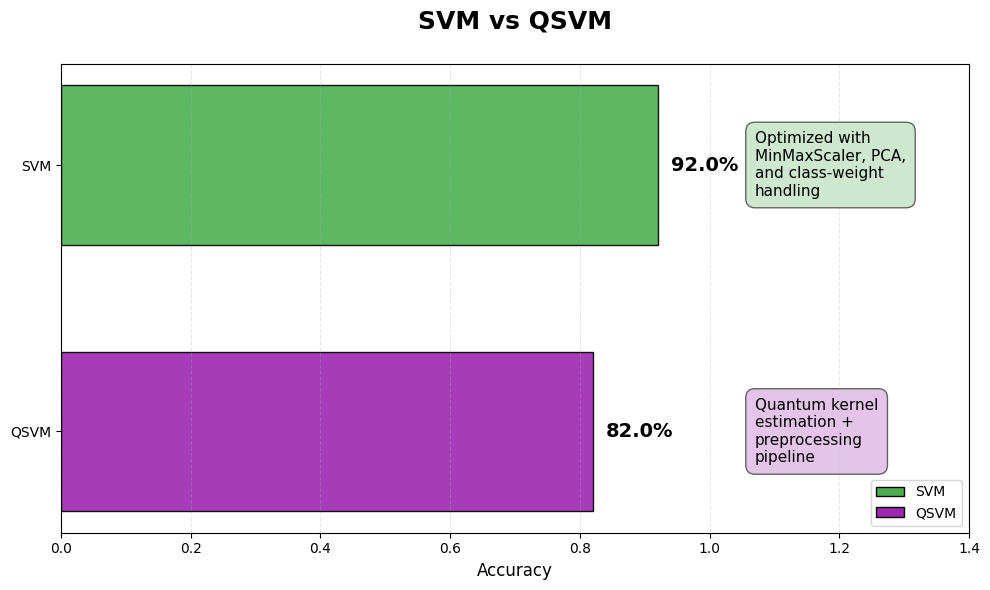
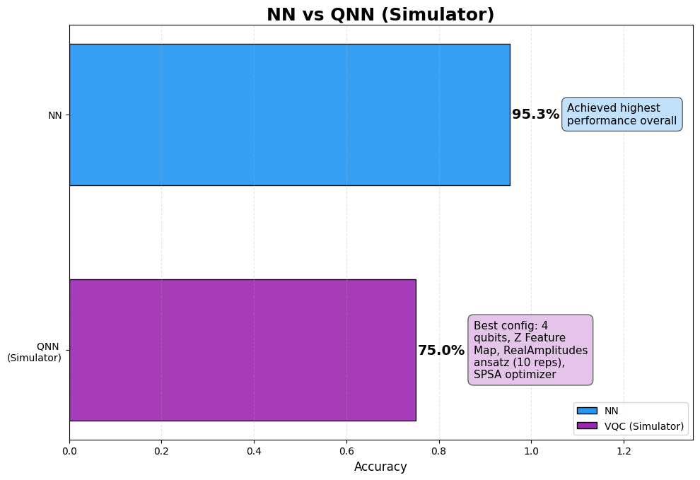

# QMedicine for Parkinson’s Disease Classification 🧠
*A Comparative Study of Classical and Fully-Quantum Machine Learning Models*

---

## Abstract
Parkinson’s disease (PD) is a neurodegenerative disorder caused by progressive dopamine neuron loss, leading to motor and speech impairments.  

This repository provides a **scientific and reproducible framework** for comparing **classical ML models** and a **fully quantum variational classifier**.

---

## Hackathon Context
This project was developed during **the Alexandria Quantum Hackathon, Egypt’s first-ever national quantum hackathon hosted by the Bibliotheca Alexandrina**, where our team achieved **2nd place 🥈** with the **QMedicine Project**

---

## Project Overview
Parkinson’s disease symptoms typically appear only after **~60% of dopamine neurons are lost**, making early detection extremely challenging yet vital for treatment.
Our team developed **QMedicine**, a solution for early detection of Parkinson’s disease using both **classical** and **quantum** machine learning models.

---

## 💡 Problem Statement & Motivation
Parkinson's disease is a growing global health crisis - mortality rates **doubled** between 2000 and 2019, reaching **329,000 deaths** worldwide in 2019.

### Early detection enables:
- Slowed disease progression through early intervention  
- Improved quality of life for patients  
- Timely access to treatment  

The key challenge lies in the **“diagnostic blind spot”** — traditional methods detect PD only after significant neuronal damage has occurred.

---

## Dataset Information
**Source:** [UCI Parkinson’s Disease Classification Dataset](https://archive.ics.uci.edu/dataset/470/parkinson+s+disease+classification)

| Attribute | Description |
|------------|-------------|
| **Instances** | 756 |
| **Features** | 754 |
| **Parkinson’s Patients** | 188 |
| **Healthy Subjects** | 64 |
| **Age Range** | 33–87 years |
| **Task Type** | Binary Classification |

---

## Methodology

The project combines **quantum** and **classical** machine learning approaches for performance comparison.

### Classical Machine Learning
Benchmarked against traditional models:
- **Support Vector Machines (SVM)**
- **Neural Networks (NN)**

All classical models were optimized through standard ML pipelines for fair comparison.

---

### Quantum Machine Learning
- **Algorithms:**  
  - Quantum Support Vector Machine (QSVM)
  - Variational Quantum Classifier (VQC)  

- **Techniques Used:**
  - Dimensionality Reduction: *PCA*  
  - Class Weight Handling: *Balanced classes for SVM & QSVM*
  - Quantum data encoding: *Angle* and *Amplitude*  
  - Variational ansätze: *RealAmplitudes*, *EfficientSU2*  
  - Optimization: *SPSA* and *COBYLA*  
  - Quantum Feature Mapping: *Z Feature Map*  

---

## Evaluation Metrics
| Metric | Description |
|---------|-------------|
| **Accuracy** | Correct predictions over total predictions |
| **Precision** | True positives over predicted positives |
| **Recall** | True positives over actual positives |
| **F1-score** | Harmonic mean of precision and recall |
| **Confusion Matrix** | Model performance visualization |
| **Quantum-specific** | Circuit depth, number of qubits, number of parameters |
| **Hardware** | Final inference tested on **real IBM Quantum hardware** |

---

## Results & Insights

### SVM vs. QSVM

**Insight:**  
The classical SVM outperformed QSVM; however, QSVM achieved **competitive accuracy** using similar preprocessing — indicating strong potential for **quantum-enhanced classification**.

---

### NN vs. VQC (simulator)

**Insight:**  
The classical NN achieved the highest accuracy, but the VQC demonstrated **promising performance given the simulator constraints**.  
This suggests that **variational quantum classifiers can approach classical NN performance** in biomedical tasks and could improve further with **more qubits and optimized quantum circuits**.

---

### VQC (Real Hardware Results)
We executed multiple **QNN** configurations on the **IBM Quantum backend** `ibm_kingston`.  
The **best-performing configuration** achieved promising real-hardware performance metrics.

#### Best Real-Hardware Run

**Insight:**  
Despite quantum noise and hardware limitations, the **8-qubit QNN** achieved strong real-hardware performance, showing the **practical viability of variational quantum classifiers** in real-world biomedical tasks.

---

## Summary
| Model Type | Algorithm | Accuracy | Notes |
|-------------|------------|-----------|--------|
| **Classical** | Neural Network | **95.3%** | Best performance overall |
| **Classical** | SVM | **92%** | Strong, reliable baseline |
| **Quantum (Simulator)** | QSVM | **82%** | Competitive quantum performance |
| **Quantum (Simulator)** | VQC | **75%** | Promising simulation results |
| **Quantum (Real QPU)** | VQC (8-qubit) | **74.3%** | Real hardware execution on `ibm_kingston` |

---

## Technologies Used
- **Qiskit**, **pennylane**, **scikit-learn**, **NumPy**, **Pandas**, **Matplotlib**, **Seaborn**
- **Quantum Hardware:** IBM Quantum (`ibm_kingston`)
- **Optimization:** SPSA, COBYLA
- **Preprocessing:** PCA, MinMaxScaler, class-weight balancing

---

## Acknowledgements
This work was conducted during the **Alexandria Quantum Hackathon**  where our **QMedicine** team won **2nd place** 🥈

We thank our mentors and the organizing committee for their guidance and support in advancing Quantum Computing in Egypt.

---

## References
- [UCI Parkinson’s Dataset](https://archive.ics.uci.edu/dataset/470/parkinson+s+disease+classification)
- [Qiskit Machine Learning Documentation](https://qiskit.org/documentation/machine-learning/)
- [IBM Quantum Experience](https://quantum-computing.ibm.com/)

---

> *This repository bridges classical and quantum learning paradigms, paving the way for future hybrid AI models in healthcare.*

---

